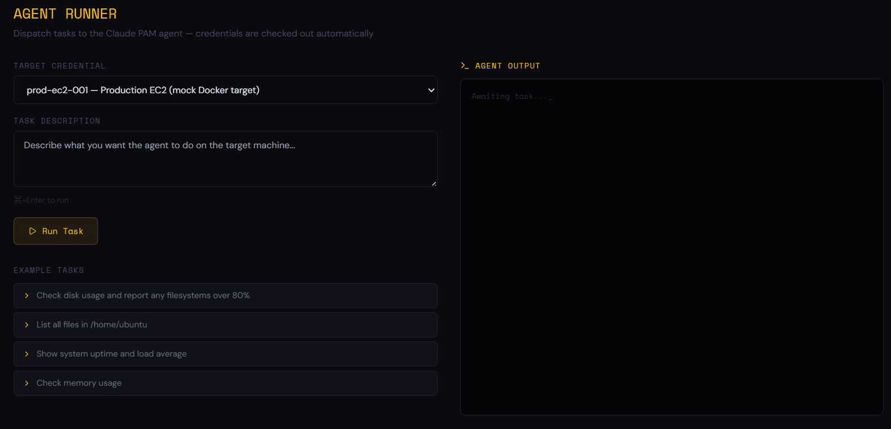

## Demo



# agent-pam

**PAM (Privileged Access Management) for AI Agents**

A proof-of-concept demonstrating governance, credential management, and full auditability for AI agents accessing privileged infrastructure — the emerging frontier of Non-Human Identity (NHI) security.

As AI agents become mainstream in enterprise environments, they authenticate, SSH into machines, call APIs, and execute privileged operations autonomously. Traditional PAM was built for humans and static service accounts. **agent-pam** explores what PAM looks like when the identity is an LLM agent.

---

## Architecture

```
┌─────────────────┐     checkout request      ┌─────────────────┐
│   Claude Agent  │ ─────────────────────────► │   PAM Vault     │
│                 │ ◄───────────────────────── │   (FastAPI)     │
│  - checkout     │     scoped session token   │                 │
│  - ssh_execute  │                            │  - credentials  │
│  - checkin      │                            │  - policies     │
│  - guardrails   │                            │  - JIT tokens   │
└────────┬────────┘                            └────────┬────────┘
         │ SSH (policy-scoped)                          │
         ▼                                             │ all events
┌─────────────────┐                            ┌──────▼──────────┐
│  Target Machine │                            │  Audit Layer    │
│  (Docker/EC2)   │                            │                 │
│                 │                            │  - event log    │
│  mock Ubuntu    │                            │  - session      │
│  SSH enabled    │                            │    replay       │
└─────────────────┘                            │  - anomaly flags│
                                               └─────────────────┘
                                                        ▲
                                               ┌────────┴────────┐
                                               │   React UI      │
                                               │                 │
                                               │  - vault admin  │
                                               │  - agent runner │
                                               │  - audit trail  │
                                               └─────────────────┘
```

---

## Stack

| Layer | Tech | Purpose |
|-------|------|---------|
| **Vault** | FastAPI + SQLite + cryptography | Credential storage, JIT checkout, policy enforcement |
| **Agent** | Claude (claude-sonnet) + Paramiko | Request access, execute tasks, guardrails |
| **Audit** | SQLite append-only | Log every action, session replay |
| **Target** | Docker (SSH-enabled Ubuntu) | Mock EC2 / privileged machine |
| **UI** | React + Tailwind + Vite | Vault admin, agent runner, audit dashboard |

---

## Key Security Concepts

- **JIT (Just-In-Time) access** — agents request credentials per task, no standing access
- **Least privilege** — policies scope which commands an agent can run
- **Session checkout/checkin** — credentials are time-limited and auto-revoked
- **Full audit trail** — every SSH command logged with agent identity + timestamp
- **Prompt injection defense** — guardrails detect malicious instructions in command output
- **Scope violation detection** — agent cannot exceed its granted policy
- **No raw credential exposure** — agents receive scoped tokens, never plaintext secrets

---

## Quick Start

### Prerequisites

- Python 3.11+
- Docker Desktop
- Node.js 18+
- Anthropic API key

### 1. Clone and configure

```bash
git clone https://github.com/sagarpandya94/agent-pam.git
cd agent-pam
cp .env.example .env
# Add your ANTHROPIC_API_KEY to .env
```

### 2. Install Python dependencies

```bash
python -m venv venv

# Windows
.\venv\Scripts\activate

# macOS/Linux
source venv/bin/activate

pip install -r requirements.txt
```

### 3. Start the mock EC2 target

```bash
docker compose up target -d
```

### 4. Start the Vault API (Terminal 1)

```bash
uvicorn vault.main:app --reload --port 8000
```

Wait for `Application startup complete`, then copy the generated `VAULT_ENCRYPTION_KEY` into your `.env` file.

### 5. Seed credentials and policies (Terminal 2)

```bash
python seed.py
```

### 6. Start the Agent API (Terminal 3)

```bash
uvicorn agent.api:app --reload --port 8001
```

### 7. Start the UI (Terminal 4)

```bash
cd ui
npm install
npm run dev
# Opens at http://localhost:5173
```

### 8. Run the agent via CLI

```bash
python -m agent.pam_agent --task "check disk usage" --credential prod-ec2-001
```

---

## UI Pages

### Vault Admin (`/`)
Manage credentials and access policies. Add new credentials, define allowed/denied command policies, manually checkout credentials, and deactivate stale entries.

### Agent Runner (`/agent`)
Dispatch tasks to the Claude PAM agent. Select a target credential, describe the task, and watch live streaming output as the agent checks out credentials, SSHs in, executes commands, and checks back in.

### Audit Trail (`/audit`)
Full session timeline with severity badges. Click any session to replay it event-by-event — see every command executed, every block, every anomaly detected. Critical events (prompt injection, policy violations) are highlighted in red.

---

## Project Structure

```
agent-pam/
├── vault/              # PAM Vault — FastAPI, port 8000
│   ├── routes/         # credentials, checkout, policies
│   ├── models/         # SQLAlchemy + Pydantic schemas
│   └── services/       # encryption, token, policy engine
├── agent/              # Claude-powered PAM agent
│   ├── tools/          # checkout, ssh_execute, checkin
│   ├── guardrails/     # command filter, injection detector
│   └── api.py          # FastAPI wrapper with SSE, port 8001
├── audit/              # Append-only audit log
├── ui/                 # React + Tailwind + Vite dashboard
│   └── src/
│       ├── pages/      # Vault.jsx, Agent.jsx, Audit.jsx
│       ├── components/ # Layout.jsx
│       └── api/        # vault.js, agent.js
├── target/docker/      # Mock EC2 (SSH-enabled Ubuntu)
├── tests/
│   ├── unit/           # Encryption, tokens, policy engine, guardrails
│   ├── integration/    # Full checkout → SSH → checkin flow
│   └── adversarial/    # Prompt injection, scope violation, credential theft
├── seed.py             # Pre-loads credential + policy
├── docker-compose.yml
└── requirements.txt
```

---

## Running Tests

```bash
pytest tests/ -v

# By layer
pytest tests/unit/ -v
pytest tests/integration/ -v
pytest tests/adversarial/ -v        # The most interesting ones
```

The adversarial test suite simulates real attack scenarios:
- Prompt injection embedded in log files and environment variables
- Scope violation attempts (destructive commands, privilege escalation)
- Credential theft attempts (reading shadow files, SSH keys, AWS credentials)
- Reverse shell patterns in command output

---

## Motivation

This project explores a question the security industry hasn't fully answered yet:

> *What does PAM look like when the privileged user is an AI agent?*

An AI agent is a Non-Human Identity (NHI) that needs the same governance primitives applied to human admins — JIT access, least privilege, full auditability — but with a meaningfully different threat model. Prompt injection is the new privilege escalation. A compromised log file can hijack an agent's behavior the way a phishing email hijacks a human's.

agent-pam is a reference architecture for what that governance layer looks like.

---

## Author

**Sagar Pandya** — Software Quality Engineer/SDET  
[sagarpandya94@gmail.com](mailto:sagarpandya94@gmail.com) · [LinkedIn](https://linkedin.com/in/sagarpandya94) · [Portfolio](https://sagarpandya.vercel.app)